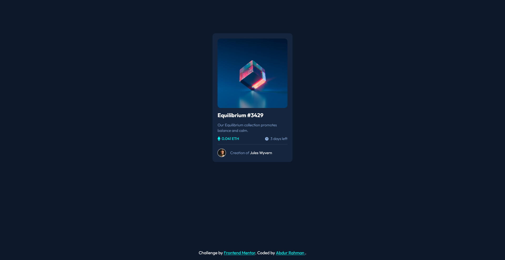

# Frontend Mentor - NFT preview card component solution

This is a solution to the [NFT preview card component challenge on Frontend Mentor](https://www.frontendmentor.io/challenges/nft-preview-card-component-SbdUL_w0U). Frontend Mentor challenges help you improve your coding skills by building realistic projects. 

## Table of contents

- [Overview](#overview)
  - [The challenge](#the-challenge)
  - [Screenshot](#screenshot)
  - [Links](#links)
- [My process](#my-process)
  - [Built with](#built-with)
  - [What I learned](#what-i-learned)
  - [Continued development](#continued-development)
  - [Useful resources](#useful-resources)
- [Author](#author)


## Overview

### The challenge

Users should be able to:

- View the optimal layout depending on their device's screen size
- See hover states for interactive elements

### Screenshot



### Links

- Solution URL: [GitHub](https://nuraf9607.github.io/fm-nft-preview-card/)
- Live Site URL: [Live Link](https://nuraf9607.github.io/fm-nft-preview-card/)

## My process

### Built with

- Semantic HTML5 markup
- CSS custom properties
- Flexbox
- CSS Grid


### What I learned

Today I have got a bit more of understanding about ::before element, I also have used background shorthand in the end which helped me to write less line of code

To see how you can add code snippets, see below:

```html
 <div class="equilibrium b-r">
  
</div>
```
```css
.equilibrium::before {
  content: "";
  position: absolute;
  background: url(images/icon-view.svg) no-repeat center/2.3rem
    rgba(0, 255, 255, 0.466);
  inset: 0;
  opacity: 0;
  background-color: rgba(0, 255, 255, 0.466);
  transition: all 0.3s ease-in-out;
  cursor: pointer;
}
```


### Continued development

I would like to look into more about animation 

### Useful resources

Nothing new in particular


## Author

- Website - Haven't created yet
- Frontend Mentor - [@nuraf9607](https://www.frontendmentor.io/profile/nuraf9607)
- Twitter - [@theAbdurRahman1](https://x.com/theAbdurRahman1)


